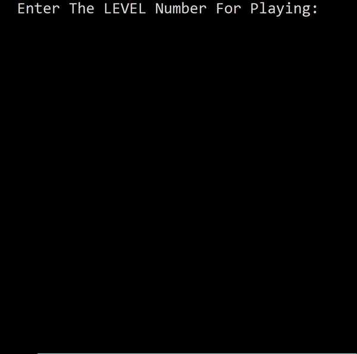

# PacMan
A simple implementation of a Pacman game in C, where you control Pacman to collect hearts while avoiding walls.
The game features an automated mode that uses the Breadth-First Search (BFS) algorithm to find the nearest hearts. The visuals are represented using ASCII characters, and collisions with walls result in losing a heart.

## Features
- **ASCII Graphics**: The game uses ASCII characters for visuals, including walls and hearts and the Pacman himself.
- **Automated Mode**: Activate a mode where Pacman automatically searches for hearts using BFS.
- **Collision Detection**: Pacman loses a heart when colliding with walls.
- **Sound Effects**: Victory sounds are played upon collecting all hearts.


## BFS Functions

### Enqueue and Dequeue

```c
void enqueue(Queue *q, int a) {
    q->arr[q->j++] = a;
}

int isEmpty(Queue *q) {
    return q->i >= q->j;
}

int dequeue(Queue *q) {
    return q->arr[q->i++];
}
```
- **enqueue**: Adds an element to the queue.
- **isEmpty**: Checks if the queue is empty.
- **dequeue**: Removes and returns an element from the queue.

### Move Validation

```c
int isOk(char map[100][100], int column, int row, int side, int position) {
    // Logic to check if the next move is valid (not hitting a wall)
}
```
- This function checks whether a move in a specified direction will encounter an obstacle (like a wall).

### Movement Logic
The movement function determines how Pacman moves based on user input:
```c
int move(char map[100][100], int side, int position, int column, int row, int *dots, int *lifes) {
    // Logic for moving Pacman and updating the game state
}
```
- Direction Mapping
  - **8**: Up
  - **6**: Right
  - **2**: Down
  - **4**: Left
- The function checks if the next position is valid and updates the map accordingly. If Pacman collects a heart (`'*'`), it decreases the dot count; if it hits a wall (`'#'`), it decreases lives.


### Automated Mode with BFS

The BFS function is implemented to allow Pacman to automatically navigate towards the nearest heart. Below is an explanation of the key components of the BFS logic in the code.

#### Function Definition

```c
int oneMove(char map[100][100], int position, int column, int row, int dotsPosition[100], int dotsAtFirst) {
    // Computer choosing a side in which to get to the nearest heart using BFS algorithm
}
```
- This function implements BFS to navigate towards the nearest heart by exploring valid moves and tracking visited positions.

### Color Coding
The game uses ASCII characters for visuals. Here’s how coloring can be implemented using ANSI escape codes:
```c
#define RESET   "\033[0m"
#define RED     "\033[31m"
#define GREEN   "\033[32m"
#define BLUE    "\033[34m"
// Other colors can be defined similarly

// Example usage:
printf(GREEN "Pacman" RESET);
```
- **Colors**: Different colors can be used for Pacman, walls, and hearts to enhance visibility and aesthetics. Use ANSI escape codes before printing colored text and reset afterward.

## Requirements
- A C compiler (e.g., GCC)
- Windows environment for sound functions (Beep)

## Game Controls
### Manual Control:
- Arrow keys to move Pacman (Up, Down, Left, Right)
- Press 'c' to activate **Automate mode**
### Automate Mode: 
Automatically navigates towards hearts.

## How to Run the Game
Clone the repository or download the code file.
Open your terminal/command prompt and navigate to the directory containing the code.
Compile the code using:
```bash
gcc pacman.c -o pacman.exe
```

Run the executable:
```bash
./pacman.exe
```


